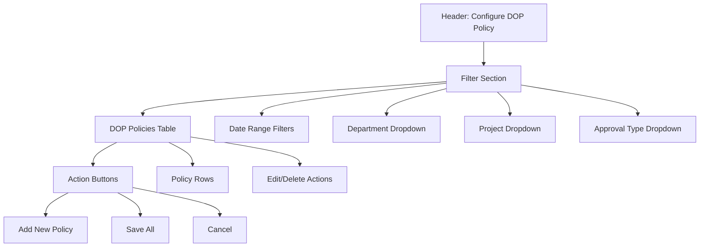

# Business Blueprint Document
## Smart Approval Management System

**Version:** 1.0  
**Date:** January 2025  
**Document Owner:** Development Team

---

## Table of Contents

1. [Executive Summary](#executive-summary)
2. [System Overview](#system-overview)
3. [Business Objectives](#business-objectives)
4. [Process Workflows](#process-workflows)
5. [User Roles and Permissions](#user-roles-and-permissions)
6. [Functional Requirements](#functional-requirements)
7. [Business Rules](#business-rules)
8. [Delegation of Power (DOP) Policy](#delegation-of-power-dop-policy)
9. [Screen Specifications](#screen-specifications)
10. [Integration Requirements](#integration-requirements)
11. [Non-Functional Requirements](#non-functional-requirements)

---

## 1. Executive Summary

The Smart Approval Management System is designed to digitize and streamline the approval process for both financial and non-financial requests within an organization. The system implements Delegation of Power (DOP) policies, ensuring approvals are routed to the appropriate authority levels based on value thresholds, department, project, and approval type.

### Key Features
- Multi-level approval workflow with recommendation stages
- Delegation of Power (DOP) policy enforcement
- Financial and non-financial approval types
- Document attachment facility
- Department/Project/Cost Center based routing
- Value break-up tracking
- Clarification and rejection workflows
- Approval closure and completion tracking
- Advanced analytics and BI dashboards
- Mobile push notifications
- WhatsApp integration for notifications and interactive chat flows

---

## 2. System Overview

### 2.1 Purpose
To provide a centralized platform for managing all organizational approvals, ensuring compliance with DOP policies, maintaining audit trails, and improving approval turnaround times.

### 2.2 Scope
- Approval request creation and management
- Multi-level approval workflow
- DOP policy configuration and enforcement
- Document management and attachments
- Master data management (Departments, Projects, Approvers, Approval Types)
- Reporting and analytics
- Advanced analytics and BI dashboards
- Mobile push notifications
- WhatsApp integration for notifications and interactive chat flows

### 2.3 Out of Scope (Initial Release)
- Budget integration with external systems
- Integration with ERP systems (Phase 2)

---

## 3. Business Objectives

1. **Compliance**: Ensure all approvals follow DOP policies
2. **Efficiency**: Reduce approval turnaround time
3. **Transparency**: Provide visibility into approval status
4. **Audit Trail**: Maintain complete history of all approvals
5. **Documentation**: Centralize all approval-related documents
6. **Accountability**: Track approvals by approver and level

---

## 4. Process Workflows

### 4.1 Approval Request Lifecycle

#### Stage A: Requester Creates Approval Request
**Actor:** Requester  
**Description:** User creates a new approval request with all required details.

**Inputs:**
- Department/Project/WBS selection
- Approval Type selection
- Approval Title
- Category (Financial/Non-Financial)
- Value (for Financial approvals)
- Value Break-up (for Financial approvals)
- Customer/Vendor Name (if applicable)
- Budget and YTD Spend
- Nature of Spend (Sustenance/Growth/Improvement)
- Background & Need description
- Document attachments

**Business Rules:**
- User must be authorized for the selected Department/Project/WBS
- Approval Type must be valid for the selected Department/Project
- For Financial approvals, value break-up total must equal approval value
- DOP policy must be linked for Financial approvals
- System validates approver selection against DOP

**Outputs:**
- Approval Request in DRAFT status
- Unique Request Number generated

#### Stage B: Assign Approvers
**Actor:** System  
**Description:** System validates and assigns approvers based on DOP policy.

**Business Rules:**
- System validates approver selection against DOP policy
- Approvers must match the approval level required for the value
- Multiple recommenders may be assigned (D1, D2 levels)
- Final approver must be at the appropriate level per DOP

**Outputs:**
- Approvers assigned to the request
- Request ready for submission

#### Stage C: Submit Request for Approval
**Actor:** Requester  
**Description:** Requester submits the draft request for approval workflow.

**Actions:**
- Change status from DRAFT to PENDING
- Trigger notifications to first-level approvers
- Lock request from further editing by requester

**Outputs:**
- Request status: PENDING
- Notifications sent to approvers

#### Stage D1 & D2: Recommend Approval Request
**Actor:** Recommenders (Multiple levels)  
**Description:** Recommenders review and provide recommendations.

**Actions Available:**
1. **Approve (Recommend)**: Forward to next level
2. **Reject**: Reject with reason code
3. **Return for Clarification**: Request clarifications from requester

**Business Rules:**
- All recommenders must approve before reaching final approver
- Any rejection stops the workflow
- Clarifications can be requested at any recommendation level
- Comments are mandatory for all actions

**Outputs:**
- Recommendation status updated
- Request forwarded to next level or returned to requester

#### Stage E: Approve/Return/Reject Request
**Actor:** Final Approver  
**Description:** Final approver makes the ultimate decision.

**Actions Available:**
1. **Approve**: Final approval granted
2. **Reject**: Final rejection with reason code
3. **Return**: Return for clarification or modification

**Business Rules:**
- Final approver decision is binding
- Approval triggers closure workflow
- Rejection closes the request
- Return sends back to requester

**Outputs:**
- Final approval status
- Request moves to closure (if approved)

#### Stage F: Update Closure
**Actor:** Requester/System  
**Description:** Upon approval, requester updates closure details.

**Inputs:**
- Approval Completion Remarks
- Closure Document Attachments
- Status update to COMPLETED

**Business Rules:**
- Closure can only be updated after final approval
- Documents can be attached for closure
- Status must be updated to COMPLETED

**Outputs:**
- Approval marked as COMPLETED
- Closure documents stored

### 4.2 Rejection Workflow

**Trigger:** Any approver selects "Reject"  
**Flow:**
1. Approver provides rejection reason code
2. Request status changes to REJECTED
3. Notification sent to requester
4. Request appears in requester's "Rejected Requests" list
5. Requester can view rejection reason

**Business Rules:**
- Rejection reason is mandatory
- Rejected requests cannot be resubmitted (new request must be created)
- Rejection is final at the level it occurs

### 4.3 Clarification Workflow

**Trigger:** Any approver selects "Request Clarification"  
**Flow:**
1. Approver requests clarification with comments
2. Request status changes to PENDING_CLARIFICATION
3. Notification sent to requester
4. Request appears in requester's "Pending Clarifications" list
5. Requester provides clarifications
6. Request status changes back to PENDING
7. Request returns to the approver who requested clarification

**Business Rules:**
- Clarification can be requested multiple times
- Requester must respond to all clarifications
- Request remains in workflow after clarification provided

---

## 5. User Roles and Permissions

### 5.1 Role Definitions

#### Admin
- Configure DOP policies
- Create and maintain approval types
- Maintain master data (Departments, Projects, Approvers, Users)
- View all approvals and reports
- Manage user authorizations

#### Approver
- View pending approvals assigned to them
- Approve, reject, or return requests
- Request clarifications
- View approval history

#### Requester
- Create approval requests
- Submit requests for approval
- Respond to clarifications
- View own approval requests
- Update approval closure

#### Viewer
- View approvals (read-only)
- Access reports and dashboards

### 5.2 Authorization Rules

- Users must be authorized for specific Departments/Projects/WBS
- Authorization is granted by Admin
- Users can only create requests for authorized Departments/Projects
- Approvers are assigned based on DOP policy
- Users can only view approvals they are authorized for

---

## 6. Functional Requirements

### 6.1 Admin Functions

#### FR-ADM-001: Configure Delegation of Power Policy
**Description:** Admin can configure DOP policies defining approval levels based on value ranges.

**Fields:**
- Valid From Date
- Valid Upto Date
- Department
- Project (optional)
- Approval Type (Financial only)
- Value From
- Value To
- Final Approval by Level

**Actions:**
- Add new DOP policy
- Edit existing policy
- Deactivate policy
- View policy history

**Business Rules:**
- Only Financial approval types can have DOP policies
- Value ranges must not overlap for same Department/Project/Approval Type
- Policies must have valid date ranges
- Deactivated policies cannot be used for new requests

#### FR-ADM-002: Create Approval Types
**Description:** Admin can create and configure approval types.

**Fields:**
- Department
- Project (optional)
- Approval Type Code
- Approval Type Name
- Description
- Nature of Approval (Financial/Non-Financial)
- Include Vendor Name (Yes/No)
- Include Customer Name (Yes/No)
- Value Break-up Template (Sequence, Item Name, Item Description)
- Link to DOP Policy (for Financial approvals)

**Actions:**
- Create new approval type
- Edit existing approval type
- Deactivate approval type
- View approval type details

**Business Rules:**
- Approval types are specific to Department/Project combination
- Value break-up template is mandatory for Financial approvals
- DOP policy link is mandatory for Financial approvals
- Non-Financial approvals cannot have DOP policies

#### FR-ADM-003: Maintain Master Data

##### FR-ADM-003a: Maintain Departments and Cost Centers
**Fields:**
- Department Code
- Department Name
- Cost Center Code
- Cost Center Name
- Link multiple Cost Centers to Department

**Actions:**
- Add/Edit Department
- Add/Edit Cost Center
- Link Cost Centers to Departments
- Deactivate Department/Cost Center

##### FR-ADM-003b: Define Projects
**Fields:**
- Project Code
- Project Name
- WBS Code
- WBS Name
- WBS Hierarchy (Parent-Child relationship)

**Actions:**
- Add/Edit Project
- Create WBS hierarchy
- Deactivate Project/WBS

##### FR-ADM-003c: Maintain Approvers
**Fields:**
- Department or Project
- Approver Employee Number
- Approver Name
- Designation
- Approval Level

**Actions:**
- Add/Edit Approver
- Assign Approver to Department/Project
- Deactivate Approver

##### FR-ADM-003d: Maintain User Authorizations
**Fields:**
- User
- Department/Project/WBS
- Authorization Type (Create/View/Approve)

**Actions:**
- Grant authorization
- Revoke authorization
- View user authorizations

### 6.2 Application Functions

#### FR-APP-001: My Approval Requests
**Description:** Requester can view and manage their approval requests.

**Sections:**
1. **Create New Request Button**
2. **In-Draft Requests Table**
3. **Pending for Clarifications Table**
4. **In Progress Requests Table**
5. **Approved Requests Table** (toggle view)

**Table Columns:**
- Request Number
- Request Date
- Approval Title
- Department/Project
- Approval Type
- Value (for Financial)
- Status
- Current Approver
- Actions (Edit, View, Delete for Draft)

#### 📱 Visual Representation - My Approval Requests Screen

```
┌─────────────────────────────────────────────────────────────────────┐
│  My Approval Requests                                  [👤 User] [⚙️]│
├─────────────────────────────────────────────────────────────────────┤
│                                                                     │
│  [+ Create New Request]                                             │
│                                                                     │
│  ┌─────────────────────────────────────────────────────────────┐   │
│  │ 📝 In-Draft Requests (3)                                    │   │
│  ├──────┬──────────┬──────────────────┬──────────┬────────────┤   │
│  │ Req# │ Date     │ Title            │ Type     │ Actions    │   │
│  ├──────┼──────────┼──────────────────┼──────────┼────────────┤   │
│  │REQ-  │2025-01-14│New Server Setup  │Contract  │[✏️][👁️][🗑️]│   │
│  │2025- │          │                  │Placement │            │   │
│  │00120 │          │                  │          │            │   │
│  ├──────┼──────────┼──────────────────┼──────────┼────────────┤   │
│  │REQ-  │2025-01-13│Software License  │Purchase  │[✏️][👁️][🗑️]│   │
│  │2025- │          │                  │          │            │   │
│  │00118 │          │                  │          │            │   │
│  └──────┴──────────┴──────────────────┴──────────┴────────────┘   │
│                                                                     │
│  ┌─────────────────────────────────────────────────────────────┐   │
│  │ ❓ Pending for Clarifications (2)                            │   │
│  ├──────┬──────────┬──────────────────┬──────────┬────────────┤   │
│  │ Req# │ Date     │ Title            │ Status   │ Actions    │   │
│  ├──────┼──────────┼──────────────────┼──────────┼────────────┤   │
│  │REQ-  │2025-01-12│Budget Approval   │Pending   │[✏️][👁️]    │   │
│  │2025- │          │                  │Clarif.   │            │   │
│  │00115 │          │                  │          │            │   │
│  └──────┴──────────┴──────────────────┴──────────┴────────────┘   │
│                                                                     │
│  ┌─────────────────────────────────────────────────────────────┐   │
│  │ ⏳ In Progress Requests (5)                                  │   │
│  ├──────┬──────────┬──────────┬──────────┬──────────┬─────────┤   │
│  │ Req# │ Date     │ Title    │ Value    │ Status   │ Approver│   │
│  ├──────┼──────────┼──────────┼──────────┼──────────┼─────────┤   │
│  │REQ-  │2025-01-10│Contract  │ 25.50L   │ Pending  │J. Smith │   │
│  │2025- │          │Placement │          │          │         │   │
│  │00110 │          │          │          │          │         │   │
│  ├──────┼──────────┼──────────┼──────────┼──────────┼─────────┤   │
│  │REQ-  │2025-01-08│Purchase  │ 12.00L   │ Pending  │B. Johnson│   │
│  │2025- │          │Request   │          │          │         │   │
│  │00105 │          │          │          │          │         │   │
│  └──────┴──────────┴──────────┴──────────┴──────────┴─────────┘   │
│                                                                     │
│  ┌─────────────────────────────────────────────────────────────┐   │
│  │ ✅ Approved Requests (Toggle: Show/Hide)                    │   │
│  ├──────┬──────────┬──────────┬──────────┬──────────┬─────────┤   │
│  │ Req# │ Date     │ Title    │ Value    │ Approved │ Actions │   │
│  │      │          │          │          │ Date     │         │   │
│  ├──────┼──────────┼──────────┼──────────┼──────────┼─────────┤   │
│  │REQ-  │2025-01-05│Equipment │ 8.50L    │2025-01-07│[👁️][📋] │   │
│  │2025- │          │Purchase  │          │          │         │   │
│  │00100 │          │          │          │          │         │   │
│  └──────┴──────────┴──────────┴──────────┴──────────┴─────────┘   │
│                                                                     │
└─────────────────────────────────────────────────────────────────────┘
```

**Create Request Form:**
- Department/Project/WBS selection
- Approval Type selection (filtered by authorization)
- Approval Title
- Category (Financial/Non-Financial) - auto-filled from approval type
- Approval Type Description - read-only
- Vendor Name or Customer Name (if applicable)
- Approval Value (for Financial)
- Value Break-up table (for Financial)
- DOP Policy display
- Approver selection (validated against DOP)
- Background & Need
- Budget
- YTD Spend
- Nature of Spend (Sustenance/Growth/Improvement)
- Document Attachments
- Actions: Discard, Save as Draft, Submit

**Business Rules:**
- Value break-up total must equal Approval Value
- Approver selection must comply with DOP
- Draft requests can be edited
- Submitted requests cannot be edited
- Request number generated on Draft/Submit

#### FR-APP-002: My Approvals
**Description:** Approver can view and act on approvals assigned to them.

**Sections:**
1. **Pending for Approval Table**
2. **Clarifications Sought Table**

**Table Columns:**
- Request Number
- Request Date
- Requester Name
- Approval Title
- Department/Project
- Approval Type
- Value (for Financial)
- Status
- Days Pending

**Approval Action Screen:**
- Full approval request details (read-only)
- Approval workflow history
- Document attachments
- Actions:
  - Approve (with comments)
  - Reject (with reason code)
  - Return (with remarks)
  - Request Clarification (to requester or previous level)

**Business Rules:**
- Comments mandatory for all actions
- Rejection reason code mandatory for reject
- Clarification can be sent to requester or previous approver
- Approval forwards to next level per workflow

#### 📱 Visual Representation - My Approvals Screen

```
┌─────────────────────────────────────────────────────────────────────┐
│  My Approvals                                          [👤 User] [⚙️]│
├─────────────────────────────────────────────────────────────────────┤
│                                                                     │
│  ┌─────────────────────────────────────────────────────────────┐   │
│  │ ⏳ Pending for Approval (8)                                   │   │
│  ├──────┬──────────┬──────────┬──────────┬──────────┬──────────┤   │
│  │ Req# │ Date     │ Requester│ Title    │ Value    │ Days     │   │
│  ├──────┼──────────┼──────────┼──────────┼──────────┼──────────┤   │
│  │REQ-  │2025-01-10│J. Doe    │Contract  │ 25.50L   │ 5 days  │   │
│  │2025- │          │          │Placement │          │ [👁️][✅]│   │
│  │00110 │          │          │          │          │         │   │
│  ├──────┼──────────┼──────────┼──────────┼──────────┼──────────┤   │
│  │REQ-  │2025-01-09│M. Brown  │Purchase  │ 15.00L   │ 6 days  │   │
│  │2025- │          │          │Request   │          │ [👁️][✅]│   │
│  │00108 │          │          │          │          │         │   │
│  └──────┴──────────┴──────────┴──────────┴──────────┴──────────┘   │
│                                                                     │
│  ┌─────────────────────────────────────────────────────────────┐   │
│  │ ❓ Clarifications Sought (2)                                 │   │
│  ├──────┬──────────┬──────────┬──────────┬──────────┬──────────┤   │
│  │ Req# │ Date     │ Requester│ Title    │ Status   │ Actions  │   │
│  ├──────┼──────────┼──────────┼──────────┼──────────┼──────────┤   │
│  │REQ-  │2025-01-08│K. Wilson │Budget    │Pending   │[👁️][✏️] │   │
│  │2025- │          │          │Approval  │Clarif.   │         │   │
│  │00105 │          │          │          │          │         │   │
│  └──────┴──────────┴──────────┴──────────┴──────────┴──────────┘   │
│                                                                     │
└─────────────────────────────────────────────────────────────────────┘

┌─────────────────────────────────────────────────────────────────────┐
│  Approval Action - REQ-2025-00110                      [← Back]      │
├─────────────────────────────────────────────────────────────────────┤
│                                                                     │
│  Request Details:                                                    │
│  ┌─────────────────────────────────────────────────────────────┐   │
│  │ Request Number: REQ-2025-00110                              │   │
│  │ Title: New Server Infrastructure Setup                        │   │
│  │ Requester: John Doe, IT Manager                              │   │
│  │ Department: IT / Project: Cloud Migration                    │   │
│  │ Approval Type: Contract Placement                            │   │
│  │ Value: 25.50 Lakhs                                           │   │
│  │ Status: PENDING                                              │   │
│  └─────────────────────────────────────────────────────────────┘   │
│                                                                     │
│  Approval Workflow History:                                         │
│  ┌─────────────────────────────────────────────────────────────┐   │
│  │ Level D1: Jane Smith, Senior Manager                        │   │
│  │ Status: ✅ APPROVED on 2025-01-11                            │   │
│  │ Comments: "Looks good, proceeding to next level"            │   │
│  │                                                              │   │
│  │ Level D2: [Current] Bob Johnson, Director                  │   │
│  │ Status: ⏳ PENDING                                           │   │
│  │                                                              │   │
│  │ Final Level: Alice Williams, CIO                            │   │
│  │ Status: ⏸️ AWAITING                                            │   │
│  └─────────────────────────────────────────────────────────────┘   │
│                                                                     │
│  Document Attachments:                                             │
│  • 📄 Quote_ABC_Technologies.pdf [⬇️ Download]                    │   │
│  • 📄 Technical_Specification.docx [⬇️ Download]                │   │
│                                                                     │
│  ┌─────────────────────────────────────────────────────────────┐   │
│  │ Your Action (Level D2)                                       │   │
│  ├─────────────────────────────────────────────────────────────┤   │
│  │ ○ Approve  ○ Reject  ○ Return  ○ Request Clarification      │   │
│  │                                                              │   │
│  │ Comments: *                                                  │   │
│  │ ┌──────────────────────────────────────────────────────┐   │   │
│  │ │ [Enter your comments here...]                        │   │   │
│  │ └──────────────────────────────────────────────────────┘   │   │
│  │                                                              │   │
│  │ Rejection Reason Code: [▼ Select reason...] (if Reject)   │   │
│  │                                                              │   │
│  │ [✅ Submit Action] [❌ Cancel]                             │   │
│  └─────────────────────────────────────────────────────────────┘   │
│                                                                     │
└─────────────────────────────────────────────────────────────────────┘
```

### 6.3 MIS and Reports

#### FR-REP-001: Approval List
**Description:** View all approvals with filtering and export capabilities.

**Filters:**
- Date Range
- Department/Project
- Approval Type
- Status
- Requester
- Approver
- Value Range

**Columns:**
- Request Number
- Request Date
- Requester
- Department/Project
- Approval Type
- Value
- Status
- Current Approver
- Days in System
- Approval Date (if approved)

**Actions:**
- Export to Excel/PDF
- Print
- Filter and Sort

#### 📱 Visual Representation - Approval List Report Screen

```
┌─────────────────────────────────────────────────────────────────────┐
│  Approval List Report                                  [👤 User] [⚙️]│
├─────────────────────────────────────────────────────────────────────┤
│                                                                     │
│  Filters:                                                            │
│  ┌─────────────────────────────────────────────────────────────┐   │
│  │ Date Range: [2025-01-01] to [2025-01-31]                    │   │
│  │ Department: [▼ All Departments        ]                     │   │
│  │ Project:    [▼ All Projects            ]                     │   │
│  │ Approval Type: [▼ All Types           ]                     │   │
│  │ Status:     [▼ All Statuses            ]                     │   │
│  │ Requester:  [Search...]                                      │   │
│  │ Approver:   [Search...]                                      │   │
│  │ Value Range: [0] to [100] Lakhs                             │   │
│  │ [🔍 Search] [🔄 Reset] [📊 Export] [🖨️ Print]              │   │
│  └─────────────────────────────────────────────────────────────┘   │
│                                                                     │
│  Results: 150 approvals found                                      │
│                                                                     │
│  ┌─────────────────────────────────────────────────────────────┐   │
│  │ Approval List                                                │   │
│  ├──────┬──────────┬──────────┬──────────┬──────────┬──────────┤   │
│  │ Req# │ Date     │ Requester│ Dept/Proj│ Type     │ Value    │   │
│  ├──────┼──────────┼──────────┼──────────┼──────────┼──────────┤   │
│  │REQ-  │2025-01-15│J. Doe    │IT/Cloud  │Contract  │ 25.50L   │   │
│  │2025- │          │          │          │Placement │          │   │
│  │00123 │          │          │          │          │          │   │
│  ├──────┼──────────┼──────────┼──────────┼──────────┼──────────┤   │
│  │ Status │ Current Approver │ Days │ Approved Date │ Actions │   │
│  ├──────┼──────────┼──────────┼──────────┼──────────┼──────────┤   │
│  │✅     │A. Williams│ 10    │ 2025-01-15 │ [👁️]     │         │   │
│  │APPROVED│         │       │            │         │         │   │
│  ├──────┼──────────┼──────────┼──────────┼──────────┼──────────┤   │
│  │⏳     │B. Johnson│ 5     │ -          │ [👁️]     │         │   │
│  │PENDING│          │       │            │         │         │   │
│  └──────┴──────────┴──────────┴──────────┴──────────┴──────────┘   │
│                                                                     │
│  [◀ Previous] Page 1 of 15 [Next ▶]                                │
│                                                                     │
└─────────────────────────────────────────────────────────────────────┘
```

#### FR-REP-002: Approval Lead Times
**Description:** Analytics on approval processing times.

**Metrics:**
- Average approval time by Department
- Average approval time by Approval Type
- Average approval time by Approver Level
- Time spent at each approval stage
- Bottleneck analysis
- SLA compliance

**Visualizations:**
- Charts and graphs
- Trend analysis
- Comparative analysis

#### 📱 Visual Representation - Approval Lead Times Report Screen

```
┌─────────────────────────────────────────────────────────────────────┐
│  Approval Lead Times Report                          [👤 User] [⚙️]│
├─────────────────────────────────────────────────────────────────────┤
│                                                                     │
│  Filters:                                                            │
│  ┌─────────────────────────────────────────────────────────────┐   │
│  │ Period: [▼ Last 3 Months        ]                            │   │
│  │ Department: [▼ All Departments ]                            │   │
│  │ Approval Type: [▼ All Types    ]                            │   │
│  │ [🔍 Generate Report] [📊 Export] [🖨️ Print]                │   │
│  └─────────────────────────────────────────────────────────────┘   │
│                                                                     │
│  ┌─────────────────────────────────────────────────────────────┐   │
│  │ Key Metrics                                                   │   │
│  ├─────────────────────────────────────────────────────────────┤   │
│  │ Average Approval Time: 8.5 days                              │   │
│  │ SLA Compliance: 85%                                          │   │
│  │ Total Approvals: 450                                         │   │
│  └─────────────────────────────────────────────────────────────┘   │
│                                                                     │
│  ┌─────────────────────────────────────────────────────────────┐   │
│  │ Average Approval Time by Department                          │   │
│  │                                                               │   │
│  │ IT Department        ████████████████ 10.2 days             │   │
│  │ Finance              ████████████ 8.5 days                  │   │
│  │ HR                   ████████ 6.3 days                      │   │
│  │ Operations           ████████████ 8.8 days                   │   │
│  └─────────────────────────────────────────────────────────────┘   │
│                                                                     │
│  ┌─────────────────────────────────────────────────────────────┐   │
│  │ Time Spent at Each Stage                                      │   │
│  │                                                               │   │
│  │ Stage D1 (Recommendation)  ████████ 3.2 days                │   │
│  │ Stage D2 (Recommendation) ██████████ 4.1 days               │   │
│  │ Final Approval              ████ 1.2 days                   │   │
│  └─────────────────────────────────────────────────────────────┘   │
│                                                                     │
│  ┌─────────────────────────────────────────────────────────────┐   │
│  │ Trend Analysis (Last 6 Months)                               │   │
│  │                                                               │   │
│  │ Days │                                                       │   │
│  │  12  │     ●                                                 │   │
│  │  10  │   ●   ●                                               │   │
│  │   8  │ ●       ●   ●                                         │   │
│  │   6  │             ●   ●                                     │   │
│  │   4  │                                                       │   │
│  │      └─────────────────────────────────────                │   │
│  │      Jan  Feb  Mar  Apr  May  Jun                          │   │
│  └─────────────────────────────────────────────────────────────┘   │
│                                                                     │
│  ┌─────────────────────────────────────────────────────────────┐   │
│  │ Bottleneck Analysis                                           │   │
│  │                                                               │   │
│  │ • Stage D2 has highest average time (4.1 days)              │   │
│  │ • IT Department shows 20% above average                      │   │
│  │ • Contract Placement approvals take longest                  │   │
│  └─────────────────────────────────────────────────────────────┘   │
│                                                                     │
└─────────────────────────────────────────────────────────────────────┘
```

---

## 7. Business Rules

### 7.1 Approval Request Rules

1. **Authorization**: Users can only create requests for authorized Departments/Projects/WBS
2. **Value Validation**: For Financial approvals, value break-up total must equal approval value
3. **DOP Compliance**: Approver selection must comply with DOP policy
4. **Request Number**: Auto-generated on Draft/Submit (format: REQ-YYYY-XXXXX)
5. **Status Progression**: DRAFT → PENDING → PENDING_CLARIFICATION → APPROVED/REJECTED → COMPLETED
6. **Edit Restrictions**: Only DRAFT requests can be edited by requester
7. **Document Requirements**: Documents can be attached at any stage

### 7.2 Approval Workflow Rules

1. **Sequential Processing**: Approvals must go through all required levels
2. **Parallel Recommendations**: Multiple recommenders can process in parallel (D1, D2)
3. **Final Approval**: Only final approver can grant final approval
4. **Rejection Impact**: Any rejection stops the workflow
5. **Clarification Impact**: Clarification pauses workflow until resolved
6. **Time Limits**: SLA defined for each approval level (configurable)

### 7.3 DOP Policy Rules

1. **Financial Only**: DOP policies apply only to Financial approval types
2. **Value Ranges**: Value ranges must not overlap for same conditions
3. **Date Validity**: Policies must have valid date ranges
4. **Level Assignment**: Approval level determined by value within range
5. **Department/Project Specific**: Policies are specific to Department/Project/Approval Type combination

### 7.4 Master Data Rules

1. **Unique Codes**: All codes (Department, Project, Cost Center, Approval Type) must be unique
2. **Hierarchical Structure**: WBS maintains parent-child relationships
3. **Active Status**: Only active records can be used in new requests
4. **Approver Assignment**: Approvers must be assigned to Department/Project
5. **Authorization Inheritance**: Project authorization may inherit from Department

---

## 8. Delegation of Power (DOP) Policy

### 8.1 Policy Structure

DOP policies define the approval authority levels based on:
- **Value Range**: From value to To value
- **Department**: Specific department or All
- **Project**: Specific project or All
- **Approval Type**: Financial approval type
- **Approval Level**: Final approval authority level required

### 8.2 Policy Configuration

**Example DOP Policy:**
```
Valid From: 2025-01-01
Valid Upto: 2025-12-31
Department: IT
Project: All
Approval Type: Contract Placement Approval
Value From: 0
Value To: 5 Lakhs
Final Approval by Level: Divisional Manager

Value From: 5.01
Value To: 25 Lakhs
Final Approval by Level: Chief Information Officer

Value From: 25.01
Value To: 100 Lakhs
Final Approval by Level: Managing Director
```

### 8.3 Policy Enforcement

- System automatically determines approval level based on DOP policy
- Approver selection validated against DOP
- Policy must be active and within valid date range
- Only one policy can be active for same conditions at a time

---

## 9. Screen Specifications

> **💡 PDF Conversion Note:** For best visual results when converting to PDF:
> - Use a PDF converter that supports Mermaid diagrams (e.g., Pandoc with mermaid-filter, or online tools like Markdown PDF)
> - Consider creating actual UI mockup images and embedding them using: ``
> - The structured tables below will render well in most PDF converters
> - **See [UI Mockup Guide](./UI_MOCKUP_GUIDE.md) for detailed instructions on creating and embedding elegant UI mockups**

---

### 9.1 Menu Screen (Admin)

**Layout:**
- Left sidebar menu
- Main content area

**Menu Structure:**
```
Admin Functions
├── Configure Delegation of Power Policy
├── Create Approval Types
└── Maintain Master Data
    ├── Departments and Cost Centres
    ├── Define Projects
    ├── Maintain Approvers
    └── Maintain User Authorizations

Applications
├── My Approval Requests
└── My Approvals

MIS and Reports
├── Approval List
└── Approval Lead Times
```

#### 📱 Visual Representation - Admin Menu Screen

```
┌─────────────────────────────────────────────────────────────────┐
│  Smart Approval Management System                    [User] [⚙️] │
├──────────────┬──────────────────────────────────────────────────┤
│              │                                                  │
│  📋 Admin    │              Dashboard / Main Content Area       │
│  Functions   │                                                  │
│  ─────────   │  Welcome, Admin User                             │
│              │                                                  │
│  ⚙️ Configure│  ┌──────────────────────────────────────────┐   │
│     DOP      │  │  Quick Stats                              │   │
│     Policy   │  │  • Pending Approvals: 15                  │   │
│              │  │  • My Requests: 8                         │   │
│  📝 Create   │  │  • Overdue: 3                             │   │
│     Approval │  └──────────────────────────────────────────┘   │
│     Types    │                                                  │
│              │  ┌──────────────────────────────────────────┐   │
│  📊 Maintain │  │  Recent Activity                           │   │
│     Master   │  │  • REQ-2025-00123 - Approved              │   │
│     Data     │  │  • REQ-2025-00124 - Pending               │   │
│     ├─ Dept  │  │  • REQ-2025-00125 - Rejected              │   │
│     ├─ Proj  │  └──────────────────────────────────────────┘   │
│     ├─ Appro│                                                  │
│     └─ Users │                                                  │
│              │                                                  │
│  📱 Applica- │                                                  │
│     tions    │                                                  │
│  ─────────   │                                                  │
│              │                                                  │
│  📄 My       │                                                  │
│     Approval │                                                  │
│     Requests │                                                  │
│              │                                                  │
│  ✅ My       │                                                  │
│     Approvals│                                                  │
│              │                                                  │
│  📈 MIS &    │                                                  │
│     Reports  │                                                  │
│  ─────────   │                                                  │
│              │                                                  │
│  📊 Approval │                                                  │
│     List     │                                                  │
│              │                                                  │
│  ⏱️ Approval │                                                  │
│     Lead     │                                                  │
│     Times    │                                                  │
│              │                                                  │
└──────────────┴──────────────────────────────────────────────────┘
```

### 9.2 Configure DOP Policy Screen

**Filters:**
- Valid From Date
- Valid Upto Date
- Department (dropdown)
- Project (dropdown, optional)
- Approval Type (dropdown, Financial only)

**Table Display:**
- Department
- Project
- Approval Type
- Value From
- Value To
- Final Approval by Level
- Status (Active/Inactive)
- Actions (Edit, Deactivate)

**Actions:**
- Add New Row
- Edit Row
- Deactivate (single or multiple)
- Save Changes

#### 📱 Visual Representation - Configure DOP Policy Screen

**Screen Layout:**



**Filter Section:**

| Field | Type | Required | Description |
|-------|------|----------|-------------|
| Valid From Date | Date Picker | Yes | Policy start date |
| Valid Upto Date | Date Picker | Yes | Policy end date |
| Department | Dropdown | Yes | Select department |
| Project | Dropdown | No | Select project (optional) |
| Approval Type | Dropdown | Yes | Financial approval types only |

**DOP Policies Table:**

| Column | Type | Width | Description |
|--------|------|-------|-------------|
| Department | Text | 15% | Department name |
| Project | Text | 15% | Project name or "All" |
| Approval Type | Text | 20% | Approval type name |
| Value From | Number | 10% | Minimum value (Lakhs) |
| Value To | Number | 10% | Maximum value (Lakhs) |
| Approval Level | Text | 20% | Required approval level |
| Status | Badge | 5% | Active/Inactive |
| Actions | Buttons | 5% | Edit, Delete |

**Sample Data Table:**

| Department | Project | Approval Type | From | To | Approval Level | Status | Actions |
|------------|---------|--------------|------|-----|----------------|--------|---------|
| IT | All | Contract Placement | 0 | 5L | Divisional Manager | Active | Edit, Delete |
| IT | All | Contract Placement | 5.01 | 25L | Chief Information Officer | Active | Edit, Delete |
| IT | All | Contract Placement | 25.01 | 100L | Managing Director | Active | Edit, Delete |

**Action Buttons:**

| Button | Position | Function | Style |
|--------|----------|----------|-------|
| Add New Policy | Top Right | Opens form to add new policy | Primary |
| Save All | Bottom Right | Saves all changes | Primary |
| Cancel | Bottom Right | Discards changes | Secondary |

> **📸 Recommended:** Create a visual mockup showing the filter section and data table layout  
> **📖 See [UI Mockup Guide](./UI_MOCKUP_GUIDE.md) for creating mockup images**

### 9.3 Create Approval Types Screen

**Filter Section:**
- Department (dropdown)
- Project (dropdown, optional)
- Approval Type (text input)

**Display Logic:**
- If records exist: Display in table format
- If no records: Show message "No approval type exists for this condition. Do you want to create?"

**Form Fields:**
- Department Name (read-only, from filter)
- Project Name (read-only, from filter)
- Approval Type Code
- Approval Type Name
- Description
- Nature of Approval (Radio: Financial / Non-Financial)
- Include Vendor Name (Checkbox)
- Include Customer Name (Checkbox)
- Value Break-up Table:
  - Sequence Number
  - Item Name
  - Item Description
- Link to DOP Policy (Dropdown, shown only for Financial, lists DOP policies for Department/Project/Approval Type)

**Actions:**
- Save
- Cancel

#### 📱 Visual Representation - Create Approval Types Screen

```
┌─────────────────────────────────────────────────────────────────────┐
│  Create Approval Types                                  [← Back]    │
├─────────────────────────────────────────────────────────────────────┤
│                                                                     │
│  Filter:                                                            │
│  ┌─────────────────────────────────────────────────────────────┐   │
│  │ Department: [▼ IT Department        ]                      │   │
│  │ Project:    [▼ All Projects        ]  (Optional)           │   │
│  │ Approval Type: [Search...]                                  │   │
│  │ [🔍 Search]                                                │   │
│  └─────────────────────────────────────────────────────────────┘   │
│                                                                     │
│  ┌─────────────────────────────────────────────────────────────┐   │
│  │ Approval Type Details                                        │   │
│  ├─────────────────────────────────────────────────────────────┤   │
│  │ Department Name: [IT Department] (Read-only)                  │   │
│  │ Project Name:   [All Projects] (Read-only)                 │   │
│  │                                                              │   │
│  │ Approval Type Code:    [CONTRACT_PLACE] *                   │   │
│  │ Approval Type Name:    [Contract Placement Approval] *      │   │
│  │ Description:           [Text area...]                       │   │
│  │                                                              │   │
│  │ Nature of Approval:    ○ Financial  ● Non-Financial        │   │
│  │                                                              │   │
│  │ ☑ Include Vendor Name                                       │   │
│  │ ☐ Include Customer Name                                     │   │
│  │                                                              │   │
│  │ Value Break-up Template (for Financial only):               │   │
│  │ ┌────┬──────────────┬──────────────────────────────────┐   │   │
│  │ │Seq │ Item Name     │ Item Description                │   │   │
│  │ ├────┼──────────────┼──────────────────────────────────┤   │   │
│  │ │ 1  │ Hardware      │ [Server, Network Equipment]    │   │   │
│  │ │ 2  │ Software      │ [Licenses, Applications]        │   │   │
│  │ │ 3  │ Services      │ [Consulting, Support]           │   │   │
│  │ └────┴──────────────┴──────────────────────────────────┘   │   │
│  │                                                              │   │
│  │ Link to DOP Policy: [▼ Select DOP Policy...] (Financial)   │   │
│  │                                                              │   │
│  │ [💾 Save] [❌ Cancel]                                       │   │
│  └─────────────────────────────────────────────────────────────┘   │
│                                                                     │
└─────────────────────────────────────────────────────────────────────┘
```

### 9.4 Approval Request Format Screen

**Header:**
- Approval Title (text input)
- Category (Radio: Financial / Non-Financial)
- Type of Approval (dropdown, with note: "Configurable codes as per company's needs")
- Total Value (text input, unit: Lakhs, shown for Financial)

**Request Details:**
- Customer/Vendor (text input, shown based on approval type configuration)
- Department / Project (dropdown)
- Budget (text input)
- YTD Spend (text input)
- Nature of Spend (Checkboxes: Sustenance, Growth, Improvement)
- Background & Need (textarea)

**Value Break-up Section:**
- Table with columns: SI No, Item, Description, Value (Rs Lakhs)
- Note: "Value Break-up Template defined as per Department"
- Total row showing sum

**Document Attachments:**
- Multiple file upload fields with paperclip icon
- File name display
- Remove option

**Approval Workflow Section:**
- Request Raised By: Name, Designation (read-only)
- Recommended By (multiple levels):
  - Name, Designation
  - Radio buttons: Approve, Reject, Return
  - Comments (textarea)
- Approved By (final level):
  - Name, Designation
  - Radio buttons: Approve, Reject, Return
  - Comments (textarea)
- Note: "Level of approval Defined as per company's DOP Policy"

**Footer:**
- Company copyright information

#### 📱 Visual Representation - Approval Request Format Screen

```
┌─────────────────────────────────────────────────────────────────────┐
│  Create Approval Request                              [← Back] [💾]  │
├─────────────────────────────────────────────────────────────────────┤
│                                                                     │
│  Request Number: REQ-2025-00123 (Auto-generated)                   │
│                                                                     │
│  ┌─────────────────────────────────────────────────────────────┐   │
│  │ Header Information                                            │   │
│  ├─────────────────────────────────────────────────────────────┤   │
│  │ Approval Title: [New Server Infrastructure Setup] *          │   │
│  │                                                              │   │
│  │ Category: ○ Financial  ● Non-Financial                    │   │
│  │                                                              │   │
│  │ Type of Approval: [▼ Contract Placement Approval] *        │   │
│  │ (Configurable codes as per company's needs)                │   │
│  │                                                              │   │
│  │ Total Value: [25.50] Lakhs (Financial only)                │   │
│  └─────────────────────────────────────────────────────────────┘   │
│                                                                     │
│  ┌─────────────────────────────────────────────────────────────┐   │
│  │ Request Details                                               │   │
│  ├─────────────────────────────────────────────────────────────┤   │
│  │ Vendor Name: [ABC Technologies Pvt Ltd]                     │   │
│  │                                                              │   │
│  │ Department / Project: [▼ IT Department / Cloud Migration] * │   │
│  │                                                              │   │
│  │ Budget: [100.00] Lakhs                                      │   │
│  │ YTD Spend: [45.50] Lakhs                                     │   │
│  │                                                              │   │
│  │ Nature of Spend: ☑ Sustenance  ☑ Growth  ☐ Improvement     │   │
│  │                                                              │   │
│  │ Background & Need:                                           │   │
│  │ ┌──────────────────────────────────────────────────────┐   │   │
│  │ │ [Text area for detailed description...]              │   │   │
│  │ │                                                        │   │   │
│  │ └──────────────────────────────────────────────────────┘   │   │
│  └─────────────────────────────────────────────────────────────┘   │
│                                                                     │
│  ┌─────────────────────────────────────────────────────────────┐   │
│  │ Value Break-up (Financial only)                              │   │
│  │ (Template defined as per Department)                        │   │
│  ├────┬──────────────┬──────────────────────┬───────────────┤   │
│  │ SI │ Item         │ Description           │ Value (Lakhs) │   │
│  │ No │              │                       │               │   │
│  ├────┼──────────────┼──────────────────────┼───────────────┤   │
│  │ 1  │ Hardware     │ Servers, Storage     │    15.00     │   │
│  │ 2  │ Software     │ Licenses             │     8.50     │   │
│  │ 3  │ Services     │ Implementation       │     2.00     │   │
│  ├────┴──────────────┴──────────────────────┼───────────────┤   │
│  │ Total                                      │    25.50     │   │
│  └────────────────────────────────────────────┴───────────────┘   │
│                                                                     │
│  ┌─────────────────────────────────────────────────────────────┐   │
│  │ Document Attachments                                         │   │
│  ├─────────────────────────────────────────────────────────────┤   │
│  │ 📎 [Upload Document]                                         │   │
│  │                                                              │   │
│  │ Attached Files:                                             │   │
│  │ • 📄 Quote_ABC_Technologies.pdf [🗑️ Remove]                │   │
│  │ • 📄 Technical_Specification.docx [🗑️ Remove]             │   │
│  └─────────────────────────────────────────────────────────────┘   │
│                                                                     │
│  ┌─────────────────────────────────────────────────────────────┐   │
│  │ Approval Workflow                                            │   │
│  │ (Level of approval defined as per company's DOP Policy)     │   │
│  ├─────────────────────────────────────────────────────────────┤   │
│  │ Request Raised By:                                          │   │
│  │ John Doe, IT Manager (Read-only)                            │   │
│  │                                                              │   │
│  │ Recommended By (Level D1):                                  │   │
│  │ Jane Smith, Senior Manager                                  │   │
│  │ ○ Approve  ○ Reject  ○ Return                              │   │
│  │ Comments: [Text area...]                                    │   │
│  │                                                              │   │
│  │ Recommended By (Level D2):                                  │   │
│  │ Bob Johnson, Director                                       │   │
│  │ ○ Approve  ○ Reject  ○ Return                              │   │
│  │ Comments: [Text area...]                                    │   │
│  │                                                              │   │
│  │ Approved By (Final Level):                                  │   │
│  │ Alice Williams, CIO                                         │   │
│  │ ○ Approve  ○ Reject  ○ Return                              │   │
│  │ Comments: [Text area...]                                    │   │
│  └─────────────────────────────────────────────────────────────┘   │
│                                                                     │
│  [💾 Save as Draft] [📤 Submit for Approval] [❌ Discard]          │
│                                                                     │
│  ────────────────────────────────────────────────────────────────  │
│  © 2025 Smart Approval Management System. All rights reserved.     │
└─────────────────────────────────────────────────────────────────────┘
```

### 9.5 Approval Closure Screen

**Fields:**
- Approval Completion Remarks (textarea)
- Document Attachments (multiple file upload)
- Status (read-only, shows "Completed" after closure update)

**Actions:**
- Save Closure
- Cancel

#### 📱 Visual Representation - Approval Closure Screen

```
┌─────────────────────────────────────────────────────────────────────┐
│  Approval Closure - REQ-2025-00123                    [← Back]      │
├─────────────────────────────────────────────────────────────────────┤
│                                                                     │
│  Approval Details:                                                  │
│  ┌─────────────────────────────────────────────────────────────┐   │
│  │ Title: New Server Infrastructure Setup                      │   │
│  │ Status: ✅ APPROVED                                          │   │
│  │ Approved Date: 2025-01-15                                    │   │
│  │ Approved By: Alice Williams, CIO                             │   │
│  └─────────────────────────────────────────────────────────────┘   │
│                                                                     │
│  ┌─────────────────────────────────────────────────────────────┐   │
│  │ Closure Information                                          │   │
│  ├─────────────────────────────────────────────────────────────┤   │
│  │                                                              │   │
│  │ Approval Completion Remarks: *                               │   │
│  │ ┌──────────────────────────────────────────────────────┐   │   │
│  │ │ [Enter completion details, implementation status,    │   │   │
│  │ │  any issues encountered, final outcome...]           │   │   │
│  │ │                                                        │   │   │
│  │ │                                                        │   │   │
│  │ └──────────────────────────────────────────────────────┘   │   │
│  │                                                              │   │
│  │ Document Attachments:                                       │   │
│  │ 📎 [Upload Closure Document]                               │   │
│  │                                                              │   │
│  │ Attached Files:                                             │   │
│  │ • 📄 Implementation_Report.pdf [🗑️ Remove]                │   │
│  │ • 📄 Completion_Certificate.pdf [🗑️ Remove]               │   │
│  │                                                              │   │
│  │ Status: [COMPLETED] (Read-only)                            │   │
│  │                                                              │   │
│  │ [💾 Save Closure] [❌ Cancel]                             │   │
│  └─────────────────────────────────────────────────────────────┘   │
│                                                                     │
└─────────────────────────────────────────────────────────────────────┘
```

---

## 10. Integration Requirements

### 10.1 Email Notifications
- Send email on request submission
- Send email on approval/rejection/return
- Send email on clarification request
- Send email on clarification response
- Email templates configurable

### 10.2 Document Storage
- Files stored in file system (not database)
- Organization-based folder structure
- File size limit: 50MB per file
- Supported formats: PDF, DOC, DOCX, XLS, XLSX, PNG, JPG, JPEG, TXT

### 10.3 WhatsApp Integration
- Send WhatsApp notifications on request submission
- Send WhatsApp notifications on approval/rejection/return
- Send WhatsApp notifications on clarification request
- Send WhatsApp notifications on clarification response
- Interactive WhatsApp chat flow for approval actions
- WhatsApp message templates configurable
- **Note:** Detailed interactive WhatsApp chat flow specifications will be documented separately

### 10.4 Mobile Push Notifications
- Push notifications for approval requests
- Push notifications for status updates
- Push notifications for clarification requests
- Configurable notification preferences

### 10.5 Future Integrations (Phase 2)
- ERP system integration for budget data
- LDAP/Active Directory for user authentication
- Single Sign-On (SSO)

---

## 11. Non-Functional Requirements

### 11.1 Performance
- Page load time: < 3 seconds
- Approval list query: < 5 seconds for 10,000 records
- File upload: Support up to 50MB files
- Concurrent users: Support 500+ concurrent users

### 11.2 Security
- Role-based access control
- Data encryption at rest and in transit
- Audit trail for all actions
- Session management
- Password policy enforcement

### 11.3 Availability
- System availability: 99.5%
- Backup and recovery procedures
- Disaster recovery plan

### 11.4 Usability
- Responsive design for mobile and desktop
- Intuitive user interface
- Help documentation
- Training materials

---

## 12. Glossary

- **DOP**: Delegation of Power - Policy defining approval authority levels
- **WBS**: Work Breakdown Structure - Hierarchical project structure
- **YTD**: Year to Date
- **SLA**: Service Level Agreement
- **DRAFT**: Request status when saved but not submitted
- **PENDING**: Request status when submitted and awaiting approval
- **PENDING_CLARIFICATION**: Request status when clarification is requested
- **APPROVED**: Request status when final approval is granted
- **REJECTED**: Request status when request is rejected
- **COMPLETED**: Request status when closure is updated after approval

---

## Document Approval

**Prepared By:** Development Team  
**Reviewed By:** [To be filled]  
**Approved By:** [To be filled]  
**Version:** 1.0  
**Date:** January 2025
