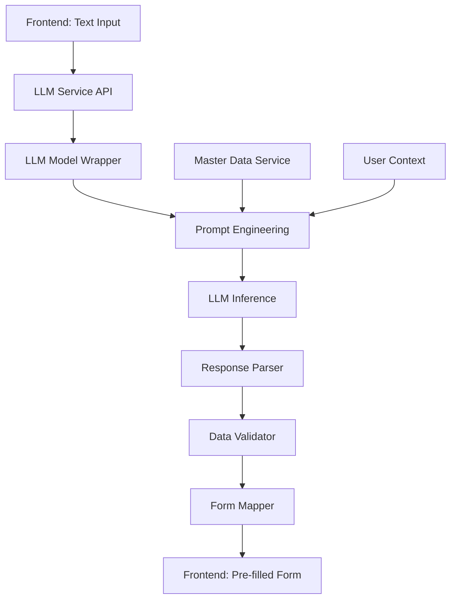

# LLM Integration for Approval Request Processing

## Overview

This document describes the integration of an open-source LLM (Large Language Model) to automatically capture, structure, and populate approval requests from natural language text input.

## 🎯 Objective

Allow users to describe their approval request in natural language, and have the LLM automatically:
- Extract structured data from the text
- Populate the approval request form
- Validate and suggest corrections
- Reduce manual data entry time

---

## 🏗️ Architecture

### High-Level Flow

```
User Input (Natural Language)
    ↓
Frontend: Text Input Component
    ↓
Backend: LLM Processing Service
    ↓
LLM Model (Open Source)
    ↓
Structured Data Extraction
    ↓
Validation & Mapping
    ↓
Form Pre-population
    ↓
User Review & Edit
    ↓
Submit Approval Request
```

### Component Architecture



---

## 🤖 Recommended Open-Source LLM Models

### Option 1: Llama 2/3 (Meta) - **Recommended**

| Model | Size | Use Case | Pros | Cons |
|-------|------|----------|------|------|
| **Llama 3 8B** | 8B params | Production | Good balance, fast inference | Requires GPU |
| **Llama 3 70B** | 70B params | High accuracy | Best accuracy | Requires high-end GPU |
| **Llama 2 7B** | 7B params | Development | Smaller, faster | Lower accuracy |

**Deployment Options:**
- **Ollama** (Recommended for local): Easy setup, runs locally
- **vLLM**: Fast inference server
- **Hugging Face Transformers**: Direct integration

### Option 2: Mistral 7B

- Smaller model (7B parameters)
- Fast inference
- Good for structured data extraction
- Available via Ollama or Hugging Face

### Option 3: Phi-2 (Microsoft)

- Very small (2.7B parameters)
- Fast inference
- Good for simple extraction tasks
- Can run on CPU

---

## 📋 Implementation Plan

### Phase 1: Backend LLM Service

#### 1.1 Add Dependencies

**Backend (`pom.xml`):**
```xml
<!-- Ollama Java Client (if using Ollama) -->
<dependency>
    <groupId>com.github.ollama</groupId>
    <artifactId>ollama-java</artifactId>
    <version>0.5.0</version>
</dependency>

<!-- Or Hugging Face Transformers -->
<dependency>
    <groupId>ai.djl</groupId>
    <artifactId>api</artifactId>
    <version>0.24.0</version>
</dependency>
```

#### 1.2 Create LLM Service Interface

```java
public interface LLMService {
    ApprovalRequestDTO extractApprovalRequest(String naturalLanguageText, UserContext context);
    ValidationResult validateExtractedData(ApprovalRequestDTO extractedData);
    List<String> suggestCorrections(ApprovalRequestDTO extractedData, ValidationResult validation);
}
```

#### 1.3 Create Prompt Template

The prompt will include:
- System context (approval system rules)
- User's available departments/projects
- Available approval types
- Output format specification (JSON)
- Examples of good inputs

#### 1.4 Create Response Parser

Parse LLM JSON response and map to `ApprovalRequestDTO`

### Phase 2: Frontend Integration

#### 2.1 Create Text Input Component

- Large textarea for natural language input
- Voice input option (future)
- Character counter
- Example prompts

#### 2.2 Create Processing UI

- Loading state during LLM processing
- Progress indicators
- Error handling

#### 2.3 Form Pre-population

- Auto-fill form fields from LLM response
- Highlight extracted fields
- Allow user to edit before submission

### Phase 3: Validation & Error Handling

- Validate extracted data against business rules
- Check required fields
- Validate department/project authorization
- Suggest corrections for invalid data

---

## 🔧 Technical Implementation

### Backend Service Structure

```
backend/src/main/java/com/smartapproval/
├── service/
│   ├── LLMService.java
│   ├── impl/
│   │   ├── OllamaLLMService.java (or HuggingFaceLLMService.java)
│   │   └── LLMPromptBuilder.java
│   └── LLMResponseParser.java
├── dto/
│   ├── LLMRequestDTO.java
│   ├── LLMResponseDTO.java
│   └── ExtractedApprovalDataDTO.java
└── controller/
    └── LLMController.java
```

### API Endpoints

```
POST /api/v1/llm/extract-approval
Request Body:
{
  "text": "I need approval for purchasing new servers for IT department...",
  "userId": 123,
  "organizationId": 1
}

Response:
{
  "success": true,
  "data": {
    "title": "New Server Purchase",
    "category": "FINANCIAL",
    "approvalType": "Contract Placement",
    "department": "IT",
    "value": 25.50,
    "valueBreakup": [...],
    "vendorName": "ABC Technologies",
    "backgroundNeed": "...",
    "confidence": 0.85,
    "extractedFields": ["title", "category", "value", "vendorName"]
  },
  "suggestions": [],
  "warnings": []
}
```

---

## 📝 Prompt Engineering

### System Prompt Template

```
You are an AI assistant that extracts structured data from approval request descriptions.

Rules:
1. Extract only information explicitly mentioned in the text
2. If information is missing, mark it as null
3. For financial approvals, extract value in Lakhs (Indian Rupees)
4. Map department/project names to available options
5. Identify approval type from context

Available Departments: {departments}
Available Projects: {projects}
Available Approval Types: {approvalTypes}

Output Format (JSON):
{
  "title": "string",
  "category": "FINANCIAL" | "NON_FINANCIAL",
  "approvalType": "string",
  "department": "string",
  "project": "string" | null,
  "value": number | null,
  "valueBreakup": [
    {"item": "string", "description": "string", "value": number}
  ],
  "vendorName": "string" | null,
  "customerName": "string" | null,
  "budget": number | null,
  "ytdSpend": number | null,
  "natureOfSpend": ["SUSTENANCE" | "GROWTH" | "IMPROVEMENT"],
  "backgroundNeed": "string"
}

User Input:
{userText}
```

### Example Prompts

**Good Input:**
```
"I need approval for purchasing new servers for the IT department. 
The total cost is 25.5 lakhs. Vendor is ABC Technologies. 
This is for the Cloud Migration project. 
Breakdown: Hardware 15L, Software 8.5L, Services 2L. 
Budget is 100L, YTD spend is 45.5L. 
This is for growth purposes."
```

**Expected Output:**
```json
{
  "title": "New Server Purchase for Cloud Migration",
  "category": "FINANCIAL",
  "approvalType": "Contract Placement",
  "department": "IT",
  "project": "Cloud Migration",
  "value": 25.5,
  "valueBreakup": [
    {"item": "Hardware", "description": "Servers", "value": 15.0},
    {"item": "Software", "description": "Licenses", "value": 8.5},
    {"item": "Services", "description": "Implementation", "value": 2.0}
  ],
  "vendorName": "ABC Technologies",
  "budget": 100.0,
  "ytdSpend": 45.5,
  "natureOfSpend": ["GROWTH"],
  "backgroundNeed": "Purchasing new servers for cloud migration project"
}
```

---

## 🚀 Deployment Options

### Option 1: Local Deployment (Ollama) - **Recommended for Development**

**Setup:**
```bash
# Install Ollama
curl -fsSL https://ollama.ai/install.sh | sh

# Pull Llama 3 model
ollama pull llama3:8b

# Start Ollama server
ollama serve
```

**Backend Configuration:**
```yaml
llm:
  provider: ollama
  base-url: http://localhost:11434
  model: llama3:8b
  timeout: 30000
  temperature: 0.3  # Lower for more deterministic output
```

### Option 2: Cloud Deployment (Hugging Face)

- Deploy model on Hugging Face Inference API
- Or use self-hosted inference endpoint
- Better for production scale

### Option 3: Docker Container

```dockerfile
FROM ollama/ollama:latest
RUN ollama pull llama3:8b
EXPOSE 11434
```

---

## ✅ Validation & Business Rules

### Extracted Data Validation

1. **Required Fields Check:**
   - Title must be present
   - Category must be valid
   - Department must be authorized for user
   - For Financial: Value must be present

2. **Business Rule Validation:**
   - Value break-up total must equal approval value
   - Department/Project must exist
   - Approval type must be valid for department
   - DOP policy compliance check

3. **Confidence Scoring:**
   - LLM provides confidence score for each field
   - Flag low-confidence fields for user review
   - Suggest corrections for invalid data

---

## 🎨 User Experience Flow

### Step 1: Text Input
```
┌─────────────────────────────────────────┐
│  Create Approval Request with AI        │
├─────────────────────────────────────────┤
│                                         │
│  Describe your approval request:       │
│  ┌───────────────────────────────────┐ │
│  │ [Large text area for input...]    │ │
│  │                                    │ │
│  │                                    │ │
│  └───────────────────────────────────┘ │
│                                         │
│  💡 Example: "I need approval for..."  │
│                                         │
│  [🎤 Voice Input] [✨ Generate Form]   │
└─────────────────────────────────────────┘
```

### Step 2: Processing
```
┌─────────────────────────────────────────┐
│  Processing your request...            │
├─────────────────────────────────────────┤
│                                         │
│  🤖 AI is analyzing your request...    │
│  [████████████░░░░] 75%                │
│                                         │
│  ✓ Extracted title                     │
│  ✓ Extracted category                  │
│  ⏳ Extracting value breakdown...      │
└─────────────────────────────────────────┘
```

### Step 3: Review & Edit
```
┌─────────────────────────────────────────┐
│  Review Extracted Data                  │
├─────────────────────────────────────────┤
│                                         │
│  ✅ High Confidence Fields:            │
│  • Title: "New Server Purchase"        │
│  • Category: Financial                 │
│  • Value: 25.5 Lakhs                   │
│                                         │
│  ⚠️  Review Required:                   │
│  • Department: [IT ▼] (Verify)         │
│                                         │
│  [✏️ Edit] [✅ Use as-is] [🔄 Regenerate]│
└─────────────────────────────────────────┘
```

---

## 📊 Performance Considerations

### Response Time Targets

| Operation | Target | Acceptable |
|-----------|--------|------------|
| Text Extraction | < 3s | < 5s |
| Validation | < 1s | < 2s |
| Form Population | < 0.5s | < 1s |

### Optimization Strategies

1. **Caching:**
   - Cache common prompts/responses
   - Cache master data (departments, projects)

2. **Model Selection:**
   - Use smaller models for faster inference
   - Use quantization (4-bit, 8-bit) for speed

3. **Async Processing:**
   - Process LLM requests asynchronously
   - Show progress to user

4. **Batch Processing:**
   - Batch multiple requests if possible

---

## 🔒 Security & Privacy

### Data Handling

- **No Data Storage:** Don't store user input text in logs
- **Local Processing:** Prefer local LLM deployment
- **Data Minimization:** Only send necessary context to LLM
- **User Consent:** Inform users about AI processing

### Access Control

- Validate user authorization before processing
- Check department/project access
- Audit LLM usage

---

## 🧪 Testing Strategy

### Unit Tests

- Test prompt generation
- Test response parsing
- Test validation logic
- Test error handling

### Integration Tests

- Test with sample approval texts
- Test with various input formats
- Test edge cases (missing data, ambiguous text)

### User Acceptance Tests

- Test with real users
- Collect feedback on extraction accuracy
- Measure time savings

---

## 📈 Success Metrics

### Key Performance Indicators

| Metric | Target | Measurement |
|--------|--------|-------------|
| Extraction Accuracy | > 85% | Fields correctly extracted |
| User Satisfaction | > 4/5 | User rating |
| Time Savings | > 50% | Time vs manual entry |
| Error Rate | < 10% | Fields requiring correction |

---

## 🚧 Future Enhancements

### Phase 2 Features

1. **Voice Input:** Speech-to-text integration
2. **Multi-language Support:** Process requests in multiple languages
3. **Learning:** Fine-tune model on company-specific data
4. **Smart Suggestions:** Suggest missing fields based on context
5. **Document Analysis:** Extract data from uploaded documents (OCR + LLM)

---

## 📚 References

- [Ollama Documentation](https://ollama.ai/docs)
- [Llama 3 Model Card](https://ai.meta.com/llama/)
- [Hugging Face Transformers](https://huggingface.co/docs/transformers)
- [Prompt Engineering Guide](https://www.promptingguide.ai/)

---

**Last Updated:** January 2025  
**Status:** Planning Phase
