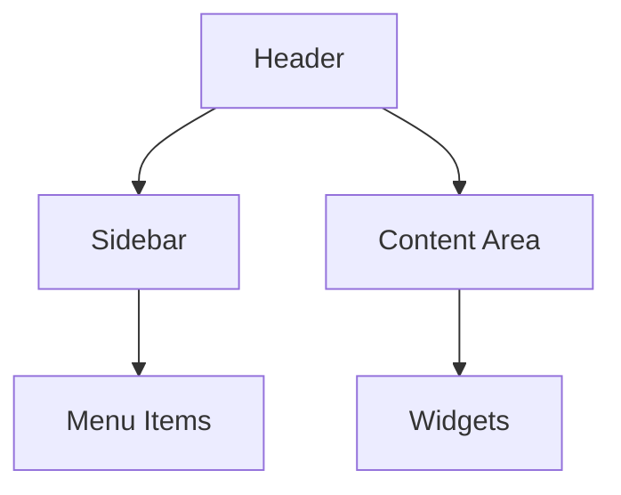
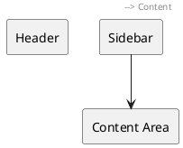

# UI Mockup Guide for Business Blueprint

This guide provides recommendations for creating elegant UI visualizations that convert well to PDF format.

## 📋 Table of Contents

1. [Recommended Tools](#recommended-tools)
2. [Creating UI Mockups](#creating-ui-mockups)
3. [Embedding in Markdown](#embedding-in-markdown)
4. [PDF Conversion Best Practices](#pdf-conversion-best-practices)
5. [Alternative Methods](#alternative-methods)

---

## 🛠️ Recommended Tools

### For Creating UI Mockups

| Tool | Type | Best For | Export Format |
|------|------|----------|---------------|
| **Figma** | Web-based | Professional mockups | PNG, PDF, SVG |
| **Adobe XD** | Desktop/Web | High-fidelity designs | PNG, PDF |
| **Balsamiq** | Desktop/Web | Quick wireframes | PNG, PDF |
| **Draw.io (diagrams.net)** | Web-based | Diagrams & layouts | PNG, SVG, PDF |
| **MockFlow** | Web-based | UI wireframes | PNG, PDF |
| **Whimsical** | Web-based | Quick mockups | PNG, PDF |

### For PDF Conversion

| Tool | Mermaid Support | Image Support | Best For |
|------|----------------|---------------|----------|
| **Pandoc** | ✅ (with filter) | ✅ | Command-line, best quality |
| **Markdown PDF** (VS Code) | ✅ | ✅ | VS Code extension |
| **md-to-pdf** (npm) | ✅ | ✅ | Node.js based |
| **GitBook** | ✅ | ✅ | Online publishing |
| **Typora** | ✅ | ✅ | WYSIWYG editor |

---

## 🎨 Creating UI Mockups

### Step 1: Create Mockup Images

1. **Use a design tool** (Figma, Adobe XD, or Draw.io)
2. **Create screens** matching the specifications in Business Blueprint
3. **Export as PNG** (high resolution, 300 DPI for PDF)
4. **Save in organized folders:**
   ```
   docs/
   └── images/
       └── ui-mockups/
           ├── admin-menu-screen.png
           ├── configure-dop-policy.png
           ├── create-approval-type.png
           ├── approval-request-form.png
           ├── approval-closure.png
           ├── my-approval-requests.png
           ├── my-approvals.png
           ├── approval-action-screen.png
           ├── approval-list-report.png
           └── approval-lead-times.png
   ```

### Step 2: Design Guidelines

**For PDF Conversion:**
- Use **high contrast** colors
- Ensure **readable font sizes** (minimum 12pt)
- Use **clear borders** and spacing
- Include **labels** for all UI elements
- Use **consistent styling** across all mockups

**Recommended Dimensions:**
- Width: 1200-1600px
- Height: 800-1200px (or as needed)
- DPI: 300 for print quality

---

## 📝 Embedding in Markdown

### Method 1: Direct Image Embedding

```markdown
#### 📱 Visual Representation - Screen Name


**Figure 9.1:** Screen Name - Visual Mockup
```

### Method 2: With Caption and Description

```markdown
#### 📱 Visual Representation - Screen Name

<div align="center">


**Figure 9.1:** Screen Name - Visual Mockup

</div>

**Description:**
- Left sidebar contains navigation menu
- Main content area displays dashboard widgets
- Header includes user menu and settings
```

### Method 3: Using HTML for Better Control

```html
<figure>
  
  <figcaption><strong>Figure 9.1:</strong> Screen Name - Visual Mockup</figcaption>
</figure>
```

---

## 📄 PDF Conversion Best Practices

### Using Pandoc (Recommended)

```bash
# Install Pandoc
# Windows: choco install pandoc
# Mac: brew install pandoc
# Linux: sudo apt-get install pandoc

# Install Mermaid filter
npm install -g @mermaid-js/mermaid-cli

# Convert to PDF with images
pandoc BUSINESS_BLUEPRINT.md \
  --filter mermaid-filter \
  --pdf-engine=xelatex \
  --highlight-style=tango \
  -o BUSINESS_BLUEPRINT.pdf
```

### Using VS Code Markdown PDF Extension

1. Install "Markdown PDF" extension
2. Open Business Blueprint markdown file
3. Right-click → "Markdown PDF: Export (pdf)"
4. Images will be embedded automatically

### Configuration File (`.pandoc.yml`)

```yaml
pdf-engine: xelatex
geometry:
  - margin=1in
  - paper=a4
fontsize: 11pt
linestretch: 1.5
header-includes:
  - \usepackage{graphicx}
  - \usepackage{float}
  - \usepackage{caption}
```

---

## 🔄 Alternative Methods

### Method 1: Mermaid Diagrams (Already Included)

Mermaid diagrams convert well to PDF. The Business Blueprint already includes Mermaid diagrams for screen layouts.

**Example:**


### Method 2: HTML Tables (PDF-Friendly)

Structured tables render well in PDF:

```markdown
| Component | Position | Description |
|-----------|----------|-------------|
| Header | Top | System header |
| Sidebar | Left | Navigation menu |
| Content | Center | Main area |
```

### Method 3: PlantUML Diagrams

If your PDF converter supports PlantUML:



---

## 📦 Quick Setup Script

Create a script to automate mockup creation and PDF generation:

```bash
#!/bin/bash
# generate-pdf.sh

echo "Generating PDF from Business Blueprint..."

# Ensure images directory exists
mkdir -p docs/images/ui-mockups

# Convert to PDF
pandoc docs/BUSINESS_BLUEPRINT.md \
  --filter mermaid-filter \
  --pdf-engine=xelatex \
  --highlight-style=tango \
  --toc \
  --toc-depth=3 \
  -o docs/BUSINESS_BLUEPRINT.pdf

echo "PDF generated: docs/BUSINESS_BLUEPRINT.pdf"
```

---

## ✅ Checklist for UI Mockups

Before embedding mockups:

- [ ] All screens have corresponding mockup images
- [ ] Images are high resolution (300 DPI)
- [ ] File names are descriptive and consistent
- [ ] Images are saved in `docs/images/ui-mockups/` folder
- [ ] Markdown references use relative paths
- [ ] Each mockup has a figure caption
- [ ] Mockups match the specifications in the document
- [ ] Colors and fonts are readable in PDF format

---

## 🎯 Next Steps

1. **Create mockup images** using your preferred design tool
2. **Save images** in `docs/images/ui-mockups/` folder
3. **Update Business Blueprint** to reference the images
4. **Test PDF conversion** to ensure images render correctly
5. **Iterate** based on PDF output quality

---

## 📚 Additional Resources

- [Pandoc User's Guide](https://pandoc.org/MANUAL.html)
- [Mermaid Documentation](https://mermaid.js.org/)
- [Figma Export Guide](https://help.figma.com/hc/en-us/articles/360040328153)
- [Markdown PDF Extension](https://marketplace.visualstudio.com/items?itemName=yzane.markdown-pdf)

---

**Last Updated:** January 2025
